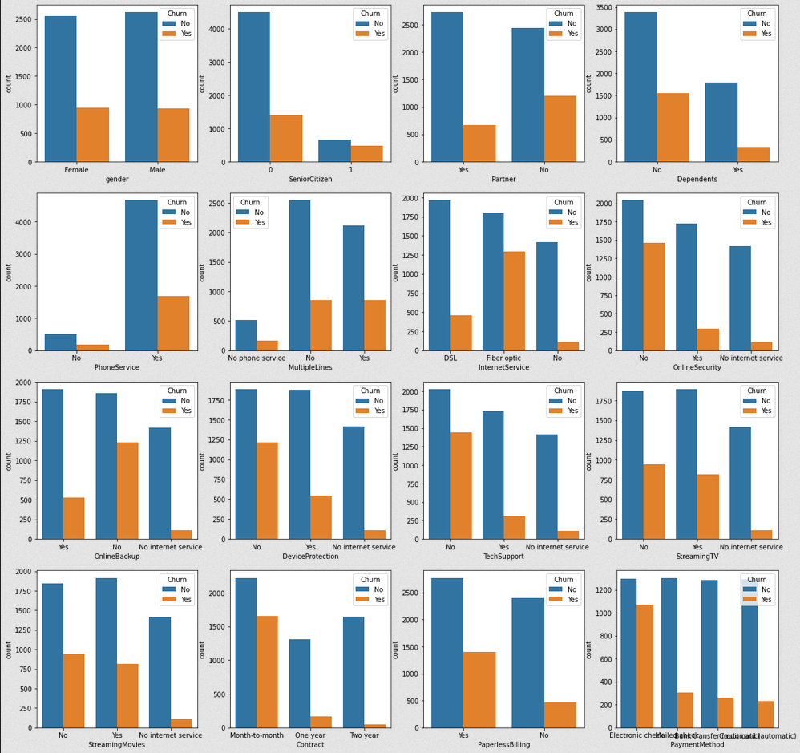
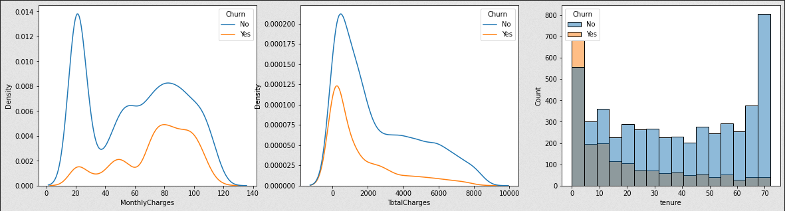
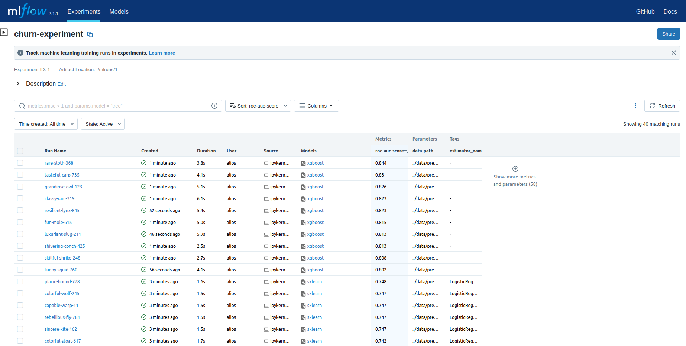
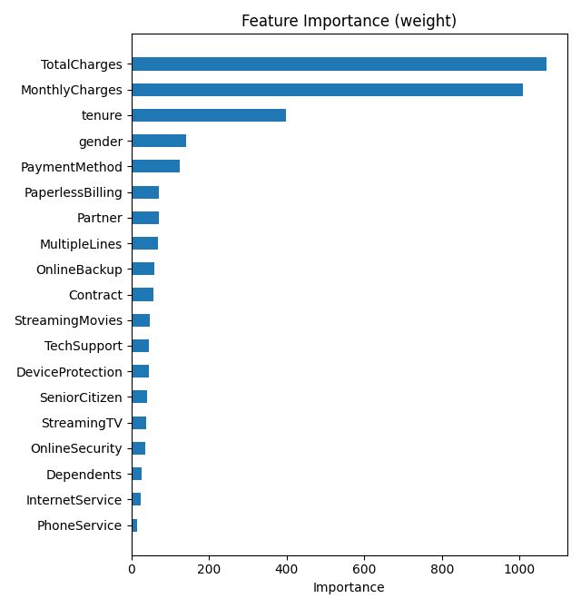

# Full Stack Churn Prediction

An end-to-end application of churn prediction with MLOps principles.

### Goals

- [x] Analysis
- [x] Model
- [x] Experiment Tracking
- [ ] API
- [ ] Front-End
- [ ] Live

---

### Tech Stack

---

### Analysis

---

### Experiment Tracking

#### Feature Importance

